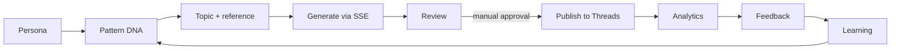

# Rocket Project

> **AI Narrative Engine** — mulai dari insight, hadirkan referensi secara alami.

Rocket membantu creator menyusun narasi yang terasa seperti obrolan manusia: persona → pola → draft → review → publish manual → feedback.

<p align="center">
  <a href="https://rocket-web-five.vercel.app"><strong>Open Studio</strong></a> ·
  <a href="https://rocket-api-hazel.vercel.app/api/threads/status"><strong>API status</strong></a> ·
  <a href="context/PRD.md"><strong>Product context</strong></a>
</p>

## Progress

| Scope | Status | Fokus |
| --- | --- | --- |
| **V1 — Narrative Engine** | <progress value="100" max="100">100%</progress> `complete` | Persona, DNA import, SSE generation, review, approval, manual Threads publish, feedback, learning, analytics |
| **V2 — Knowledge Engine** | <progress value="90" max="100">90%</progress> `active` | Hybrid retrieval, multi-angle suggestions, reviewer diagnosis, outcome-to-DNA approval, richer reference metadata |

<details>
<summary>V2 checkpoints</summary>

**Done:** hybrid semantic + lexical retrieval · evidence-aware angles · diagnosis-first reviewer output · manual analytics candidates · explicit outcome-to-DNA promotion · bounded reference metadata.

**Next:** model benchmark history and evidence-based routing.

</details>



## What is already working

- **V1:** persona workspace, metadata-only knowledge import, narrative generation, reviewer gate, manual approval, official Threads OAuth/publish, feedback learning, and manual CTR/engagement capture.
- **V2:** Qdrant semantic search with lexical fallback, editable multi-angle reference suggestions, evidence-aware reviewer diagnostics, explicit positive/negative outcome promotion, and transient reference metadata enrichment.
- **Guardrails:** every LLM call uses the orchestrator, raw thread/page content is not persisted, links stay contextual, and source files stay under 200 lines.

## Quick start

1. Copy `apps/api/.env.example` to `apps/api/.env` and add an OpenRouter key for live generation. Without it, the API uses a safe demo response.
2. Start local services: `docker compose up -d`.
3. Install dependencies: `npm install`.
4. Start the API: `npm run dev:api`.
5. In another terminal start the web app: `npm run dev`.
6. Open `http://localhost:3000`.

Local endpoints: web `http://localhost:3000` · API `http://localhost:4000`.

## Production

- Web: [rocket-web-five.vercel.app](https://rocket-web-five.vercel.app)
- API: [rocket-api-hazel.vercel.app](https://rocket-api-hazel.vercel.app)

Production uses Vercel environment variables. Never commit `.env`, tokens, app secrets, or encryption keys.

## Knowledge and references

Knowledge stores narrative DNA only: hook, emotion, conflict, information gap, discussion pattern, diagnosis, root cause, fix, dimensions, and evidence provenance. Qdrant stores the derived vector index.

Reference previews are bounded and transient. When available, Rocket can use type, site, author, section, publish time, price, currency, and canonical URL in the orchestrator context—never the raw page body.

Use **Reindex semantic search** after adding or changing DNA, or run:

```text
POST /knowledge/reindex
```

## Optional tools

- [Manual crawler](apps/crawler/README.md): compliant Scrapy import and same-domain Nutch discovery. No dashboard crawling or scheduled scraping in V1.
- `npm run seed:knowledge-dna`: add the reviewed metadata-only fixture, then reindex Qdrant.
- Threads connection uses official OAuth. Rocket never accepts a Threads password.

## Development rules

Read [AGENTS.md](AGENTS.md) and [context/RULES.md](context/RULES.md) before meaningful changes. Use OpenSpec for proposal → implementation → sync → archive, and Ponytail for the smallest safe solution.

```text
npm run check:lines
npm test
npm run build
```

Project context: [PRD](context/PRD.md) · [Architecture](context/ARCHITECTURE.md) · [Design](context/DESIGN.md) · [Schema](context/SCHEMA.md) · [AI-Slop rules](context/AI-SLOP.md) · [V2 audit](context/V2-AUDIT.md)

## Roadmap

V2 remaining focus: model benchmark history and evidence-based routing. Later scopes cover scheduling, richer platform analytics, reply assistance, and strategic trend selection.
