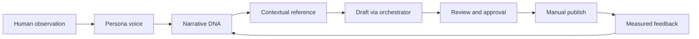

<div align="center">

<h1>ROCKET</h1>

<p><strong>An AI Narrative Engine for natural, reference-led conversations.</strong></p>

<p>
  <a href="https://rocket-web-five.vercel.app"><strong>Open Studio</strong></a>
  ·
  <a href="https://rocket-api-hazel.vercel.app/api/threads/status"><strong>API status</strong></a>
  ·
  <a href="context/PRD.md"><strong>Product context</strong></a>
</p>

<table>
  <tr>
    <td align="center"><strong>V1</strong><br><progress value="100" max="100"></progress><br>100% complete</td>
    <td align="center"><strong>V2</strong><br><progress value="90" max="100"></progress><br>90% in progress</td>
    <td align="center"><strong>Source files</strong><br><code>&lt; 200 lines</code><br>maintenance guard</td>
  </tr>
</table>

</div>

Rocket starts with a human observation, learns from narrative patterns, and treats a link as context—not as an advertisement. It is designed for creators who care about curiosity, trust, discussion quality, and a recognizable human voice.

<details>
<summary><strong>What Rocket is (and is not)</strong></summary>

Rocket is a modular narrative workspace. It combines persona thinking, pattern DNA, contextual references, review diagnostics, manual feedback, and measured outcomes into one creator-controlled flow.

It is not a generic AI writer, a thread spinner, or a product-first affiliate generator. The product never leads the story; the narrative earns the reference.

</details>

## Blueprint in one view



Every model request passes through the AI Orchestrator. Retrieval is bounded, metadata is preferred over raw source text, and publishing stays behind an explicit approval boundary.

<details>
<summary><strong>Core principles</strong></summary>

<table>
  <tr><th>Principle</th><th>Meaning</th></tr>
  <tr><td>Narrative first</td><td>Start with an insight, tension, or observation—not a product.</td></tr>
  <tr><td>Reference, not CTA</td><td>A link appears because it helps the conversation make sense.</td></tr>
  <tr><td>DNA, not copies</td><td>Store reusable patterns and diagnoses, never raw threads or page bodies.</td></tr>
  <tr><td>Human review</td><td>Approval, publishing, and learning remain visible operator decisions.</td></tr>
  <tr><td>Evidence before confidence</td><td>Claims keep provenance, and manual metrics are never presented as causation.</td></tr>
</table>

</details>

## Scope progress

| Scope | Progress | What is working |
| --- | ---: | --- |
| **V1 · Narrative Engine** | **100%** | Persona workspace, metadata-only DNA import, SSE generation, review gate, manual Threads approval/publish, feedback learning, and manual analytics. |
| **V2 · Knowledge Engine** | **90%** | Hybrid semantic + lexical retrieval, editable multi-angle suggestions, evidence-aware diagnostics, explicit outcome-to-DNA promotion, and richer transient reference metadata. |

<details>
<summary><strong>V1 delivery checklist</strong></summary>

- Persona creation and voice controls
- Knowledge import that extracts patterns instead of storing source text
- Narrative generation with server-sent progress events
- Reviewer gate with manual approval
- Official Threads OAuth and manual publishing
- Feedback learning with explicit approval
- Manual CTR and engagement calculations

</details>

<details>
<summary><strong>V2 delivery checklist</strong></summary>

- Qdrant semantic retrieval with a lexical fallback
- Reference angle suggestions with confidence, reason, and provenance
- Diagnosis-first review output and stable diagnostics
- Reviewable analytics candidates with transparent sample context
- Explicit positive/negative outcome promotion into reusable DNA
- Bounded reference metadata: type, site, author, section, date, price, currency, and canonical URL

</details>

## System shape

```text
Next.js Studio
      │
      ▼
NestJS API ──► AI Orchestrator ──► OpenRouter
      │                 │
      │                 ├── prompt and token controls
      │                 ├── retrieval context
      │                 └── response validation
      │
      ├── MongoDB  (narrative and knowledge metadata)
      ├── Qdrant   (derived semantic index)
      └── Threads  (official OAuth and approved publishing)
```

The dashboard is built with Next.js, TypeScript, and Tailwind CSS. The API is NestJS-based, with MongoDB as the metadata source of truth and Qdrant as a derived index.

## Quick start

1. Copy `apps/api/.env.example` to `apps/api/.env` and add the credentials required for your environment.
2. Start local services: `docker compose up -d`.
3. Install dependencies: `npm install`.
4. Start the API: `npm run dev:api`.
5. In another terminal, start the web app: `npm run dev`.
6. Open `http://localhost:3000`.

Local endpoints: web `http://localhost:3000` · API `http://localhost:4000`.

## Production

- Web: [rocket-web-five.vercel.app](https://rocket-web-five.vercel.app)
- API: [rocket-api-hazel.vercel.app](https://rocket-api-hazel.vercel.app)

Production secrets are managed by Vercel. Never commit `.env` files, access tokens, app secrets, encryption keys, or private source material.

## Knowledge and reference safety

Knowledge records contain narrative DNA: hooks, emotions, conflict, information gaps, discussion patterns, diagnoses, root causes, fixes, dimensions, and evidence provenance. Qdrant stores only the derived vector representation.

Reference previews are bounded and transient. When available, Rocket can use structured metadata in the orchestrator context without retaining the fetched page body.

Use **Reindex semantic search** after adding or changing DNA, or call:

```text
POST /knowledge/reindex
```

## Optional tooling

- [Manual crawler](apps/crawler/README.md): compliant Scrapy import and same-domain Nutch discovery.
- `npm run seed:knowledge-dna`: add the reviewed metadata-only fixture, then reindex Qdrant.
- Threads connection uses the official OAuth flow; Rocket never accepts a Threads password.

## Engineering guardrails

Read [AGENTS.md](AGENTS.md) and [context/RULES.md](context/RULES.md) before meaningful changes. OpenSpec documents behavior changes, while Ponytail keeps the implementation small and observable.

```text
npm run check:lines
npm test
npm run build
```

Project context: [PRD](context/PRD.md) · [Architecture](context/ARCHITECTURE.md) · [Design](context/DESIGN.md) · [Schema](context/SCHEMA.md) · [AI-Slop rules](context/AI-SLOP.md) · [V2 audit](context/V2-AUDIT.md)
